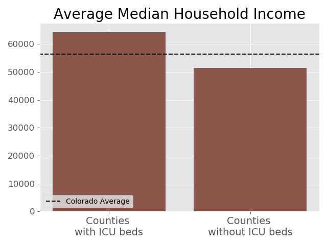

# Colorado Social Determinants of Health in the COVID Era

The 

## Exploring the Data
 Here we can see that counties that were hit hardest by the COVID-19 outbreak were also the most populous.  
 

## Exploring Hospital Access

Solarized dark             |  Solarized Ocean
:-------------------------:|:-------------------------:
  |  
