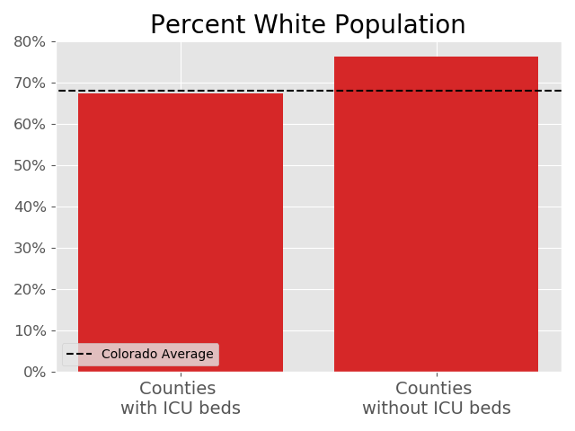
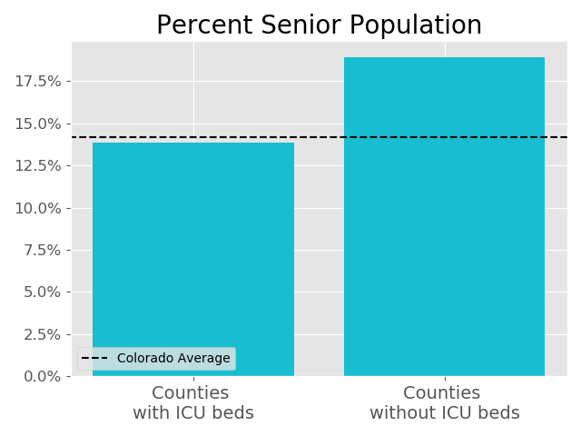
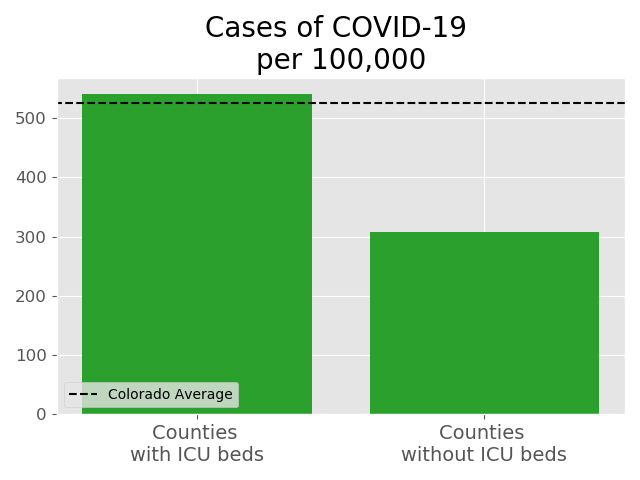
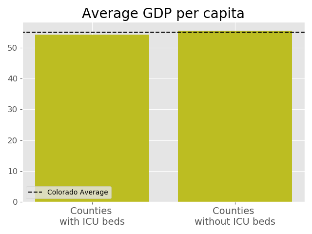
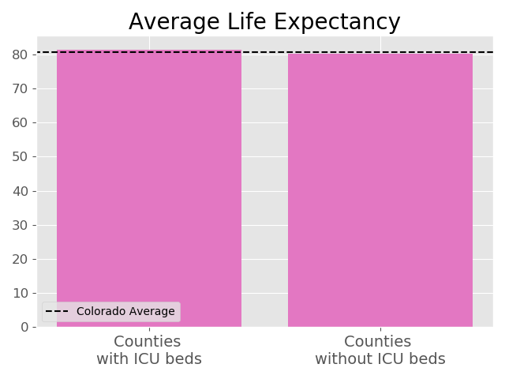
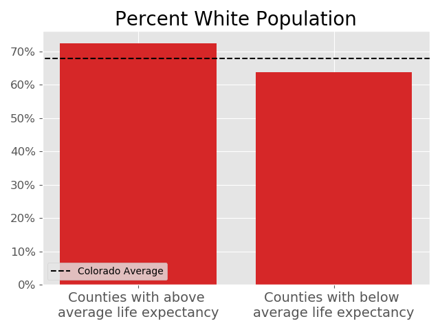
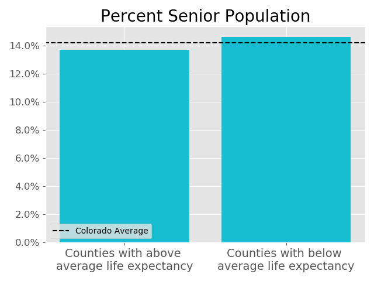
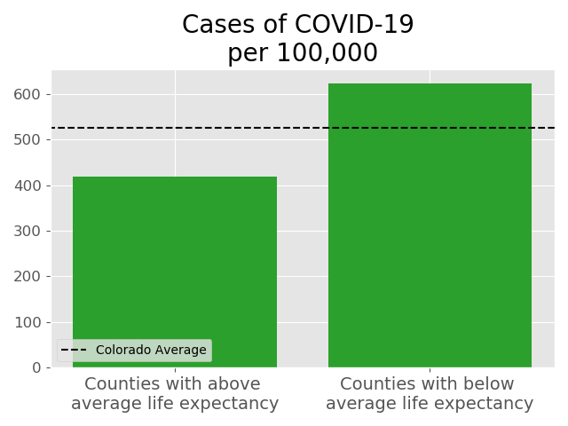
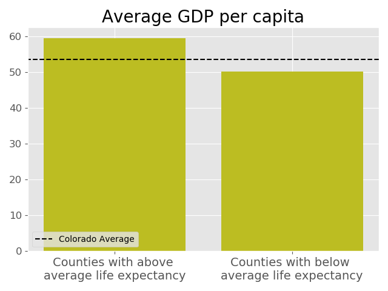

# Colorado Determinants of Health in the COVID-19 Era

* What are some patterns of counties with and without hospitals?

* Does hospital access play a role in life expectancy?

* What are the make-ups of counties with limited access to hospitals?

* What are factors that lead to lower/longer life expectancy?

---

## Exploring the Data

 To  begin with I was working with three sets of data The first containing data that breaks down Colorado counties into various demographic groups by race. This dataset also includes the number of incidences of COVID along with a few columns of economical data. Most importantly, the final column, tells us the average life expectancy for each county. 

I also used data from the US Census Bureau which provided numbers on the senior citizen(65+) population in each county.   
Lastly the 2018 Medicare Cost Report provided names of hospitals along with how many beds the hospitals have. In addition to this data I scraped a table from wikipedia that provided the name of the hospital along with the county.

On our initial exploration we can see that counties that were hit hardest by the COVID-19 outbreak were also the most populous.  

## Hospital Access

Because COVID patients are generally treated in the ICU I will be focusing on the counties that have ICU beds and comparing them to counties without. 

###  Factors of counties with and without ICU beds
-----
Starting with race we can see how these counties compare to the averages across the state.

We can see from the charts that for counties without ICU beds there is an underrepresentation of minorities. As for the counties with ICU beds they are right around the state average.

Looking at the population of senior citizens(65+)

In counties without ICU beds senior citizens are over the state average. 

---

Looking into the data on COVID-19 incidences.

    

Because of the population difference I have normalized the incidences of COVID-19 per 100,000 people.

Counties without ICU beds are well below the state average for cases of COVID-19. This could be caused by a number of factors such as lower population densities in these counties or even because of the higher senior population who (hopefully) took the stay-at-home order seriously. Or less tests done in these counties because of the lack of hospitals.

---

Next, looking at the financial factors of these two groups of counties.

While the counties' average GDP per capita are both around the statewide average there is an almost $13,000 difference in the household income.

---

Finally, what does all this mean for the average life expectancy?

Both groups of counties average within one year of each other and hover right at the state average. 

---
## If not Hospital Access, then what?

Taking our data and instead of looking at whether a county has access to an ICU or not, a better picture can be painted by looking at the counties that are below the average life expectancy.

With above average life expectancy counties clocking in at an average of 84.8 years and below average life expectancy counties at an average of 78.5, a six year difference.

---
####  Demographic breakdowns for counties based on life expectancy.

The white population shows a slight trend towards counties with above average life expectancies. While with the Hispanic population there is an over 10 percentage point difference between the two!

#### Senior population

Surprisingly, the counties with lower average life expectancies have a higher percentage of senior citizens. However, both groups of counties are right around the average for the state.

---
#### Incidences of COVID-19

Another huge difference. With high life expectancy counties showing far below the state average for cases per 100,000 while counties with below average life expectancy are well above the average.

---
####  Economic factors

There is a huge $20,000 difference in household incomes between these counties along with a gap in the GDP per capita as well.

---
## Conclusion

While having access to an ICU has almost no effect on life expectancy. However, when looking at counties with lower life expectancies some trends become clear.
* These counties' populations tend to have higher percentages of hispanics when compared to the state average.
* The average household income in these counties is below state average and $20,000 **less** when compared to counties with higher life expectancies.

----

## Further Research

What could be causing the huge gaps in household incomes between longer living counties and those with lower life expectancies? Does money really buy you a longer life?